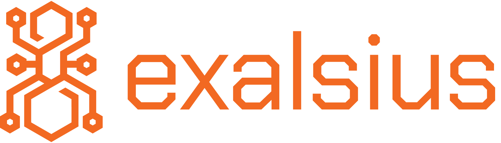

<h1 align="center">exalsius-operator</h1>

The **exalsius-operator** is a **Kubernetes operator** that extends Kubernetes with **Custom Resource Definitions (CRDs)** for dynamic, multi-cloud orchestration of **ephemeral AI clusters** and **distributed training workloads**.

As one of the **core backbone components** of the [**exalsius stack**](https://github.com/exalsius), it provides the control-plane intelligence required to **automate infrastructure provisioning**, **dependency installation**, and **lifecycle management** of training environments across **public cloud** and **on-premise** resources.

With **exalsius**, AI practitioners and engineers can:

* Dynamically provision complete, ready-to-train Kubernetes clusters
* Automatically install all required GPU and ML framework dependencies
* Execute and monitor distributed workloads across multiple providers

Together with [**exalsius-cli**](https://github.com/exalsius/exalsius-cli) and [**exalsius-api**](https://github.com/exalsius/exalsius-api), the operator forms the foundation of a **modular, decentralized, and cost-efficient AI training platform**.

## Key Features

* **Colony-Based Resource Management**
  Define and manage **Colony** resources, logical groups of Kubernetes clusters that may span multiple cloud providers or on-premise hosts.

* **Ephemeral AI Clusters**
  Automatically launch and tear down **short-lived clusters** for AI workloads, reducing idle infrastructure and optimizing cost.

* **Automated Dependency Installation**
  Deploy key components required for distributed AI training, including:

  * **NVIDIA CUDA drivers**
  * **AMD ROcm drivers**
  * **Observability stacks** (Prometheus, Grafana, etc.)
  * **Distributed ML frameworks** (Ray, Kubeflow, etc.)

* **Multi-Cloud GPU Cost Optimization**
  Deploy workloads on the most cost-efficient GPUs across **AWS**, **Azure**, **GCP**, and on-premise environments using [**exalsius-cli**](https://github.com/exalsius/exalsius-cli).

## Declarative Workflow
The **exalsius-operator** follows a **declarative approach** to multi-cluster infrastructure management using Kubernetes **Custom Resource Definitions (CRDs)**.

1. **User initiates cluster creation via the CLI**
   The process starts with the [**exls CLI application**](https://github.com/exalsius/exalsius-cli), where the user defines requirements such as on-premise machines, cloud provider, region, instance type, and Kubernetes version.

2. **exalsius-api generates and applies CRDs**
   The **exalsius-api** receives the request, translates it into Kubernetes CRDs, and submits them to the cluster where the operator is running.

3. **exalsius-operator reconciles CRDs and provisions infrastructure**
   The operator uses **Cluster API (CAPI)** and higher-level abstractions such as the **K0rdent `ClusterDeployment` CRD** to create and configure the target clusters on the selected cloud or on-premise environment.

4. **Colony resources logically group clusters**
   A `Colony` CRD provides a high-level abstraction that **bundles multiple clusters** across different geographical locations or cloud providers into a unified logical group for management and coordination.

5. **Lifecycle management and teardown**
   The operator continuously reconciles the desired and actual states of all managed clusters, and can **automatically delete** clusters when they are no longer needed, minimizing operational and cloud costs.

### Integration within the exalsius Stack

The **exalsius-operator** forms a central backbone component of the **exalsius stack**, working in close coordination with the **exalsius-api** and **exalsius-cli**:

* **[exalsius-cli](https://github.com/exalsius/exalsius-cli)**:
  A user-facing command-line interface for defining requirements and initiating cluster creation. It communicates with the **exalsius-api** to manage lifecycle operations declaratively.

* **exalsius-api** (internal backend): 
  A private backend service that exposes APIs for cluster orchestration and management. It schedules and translates user requests from the CLI into Kubernetes CRDs and communicates with the exalsius-operator to reconcile and manage resources.
*(Note: The exalsius-api is currently an internal component and not publicly available.)*

* **exalsius-operator**
  The control-plane component responsible for reconciling CRDs and turning declarative specifications into running Kubernetes clusters. It leverages **Cluster API** and **K0rdent abstractions** to provision and manage multi-cloud and on-premise clusters.

Together, these components enable **declarative, automated, and cost-efficient multi-cloud cluster orchestration** for AI and data-intensive workloads.

## Contributing
We welcome contributions! Please check the [CONTRIBUTING.md](CONTRIBUTING.md) file for guidelines.

## License

Copyright 2025.

Licensed under the Apache License, Version 2.0 (the "License");
you may not use this file except in compliance with the License.
You may obtain a copy of the License at

    http://www.apache.org/licenses/LICENSE-2.0

Unless required by applicable law or agreed to in writing, software
distributed under the License is distributed on an "AS IS" BASIS,
WITHOUT WARRANTIES OR CONDITIONS OF ANY KIND, either express or implied.
See the License for the specific language governing permissions and
limitations under the License.
