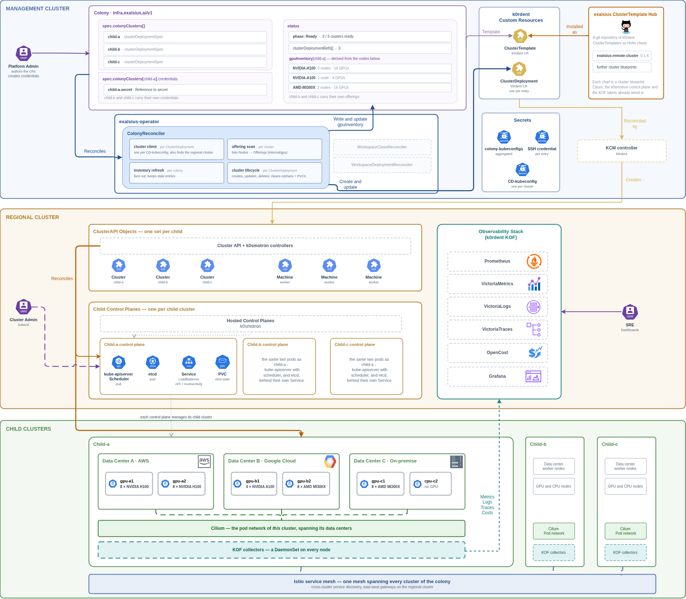
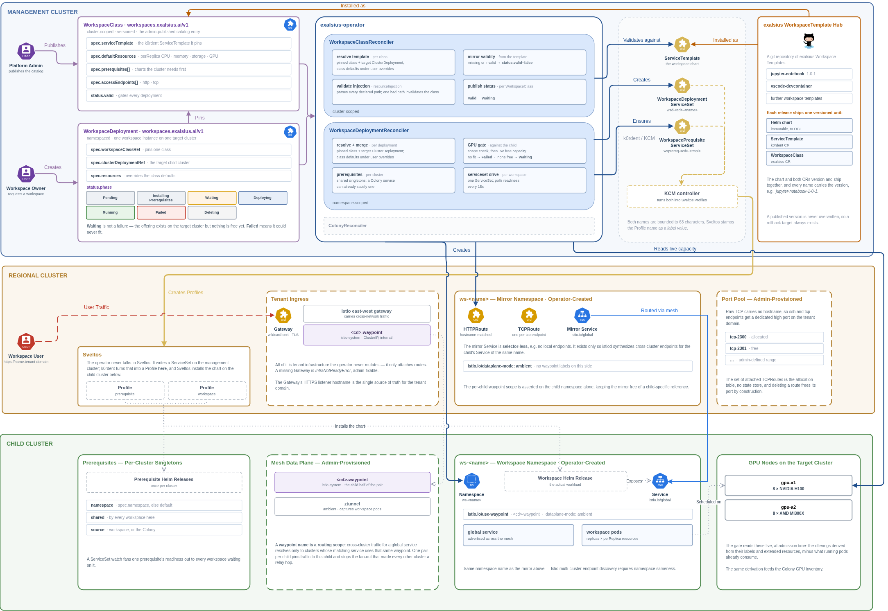

# Concepts

This page explains how the exalsius-operator's three resources turn into
clusters and running workspaces, and where each piece runs. It is background
for the [quick start](quickstart.md) and the
[Helm chart](../charts/exalsius-operator/README.md); neither requires reading
it first.

## The three resources

The operator adds three Custom Resource Definitions to a Kubernetes cluster:

- **Colony** (`infra.exalsius.ai/v1`, namespaced) lists the clusters you
  want provisioned, possibly across several cloud providers or on-premise
  sites. Each entry names a cluster template and a credential.
- **WorkspaceClass** (`workspaces.exalsius.ai/v1`, cluster-scoped) is a
  catalog entry for a *type* of workspace: a Jupyter notebook, an inference
  server, a training stack. Platform administrators publish classes; users
  pick from them. The analogy is a `StorageClass`: the class describes what
  is available, not a running instance.
- **WorkspaceDeployment** (`workspaces.exalsius.ai/v1`, namespaced) is a
  user's request for one instance of a class on one specific cluster. The
  operator publishes the instance's phase, conditions and access URLs on its
  status, so a client only ever watches this one resource.

The operator does not provision machines or install Helm charts itself. It
translates these resources into [k0rdent](https://k0rdent.io) objects and
watches k0rdent's status flow back:

```
 Colony ──────────────► ClusterDeployment (k0rdent) ──► Cluster API + k0smotron ──► child cluster
   one entry per cluster                                                            (Cilium CNI)

 WorkspaceClass ──────► ServiceTemplate (k0rdent) = the workspace's Helm chart

 WorkspaceDeployment ─► ServiceSet (k0rdent) ──► Sveltos Profile ──► Helm release on the child,
   pins one class,                                                    in namespace ws-<name>
   targets one ClusterDeployment
```

## Where things run

exalsius distinguishes three kinds of cluster:

- The **management cluster** runs k0rdent and the operator. All three
  resources, and every k0rdent object the operator creates from them, live
  here. So do the Secrets holding each child's kubeconfig, which is how the
  operator and k0rdent reach into the clusters they manage.
- A **child cluster** runs workloads. It is provisioned from a Colony entry
  and represented by a k0rdent `ClusterDeployment`. The only thing a workspace
  puts on a child is its Helm release, in a namespace named `ws-<workspace
  name>`. That namespace is the unit of isolation and cleanup for the
  workspace.
- A **regional cluster** is the per-tenant hub. It hosts the shared tenant
  infrastructure: the Gateway that terminates TLS for the tenant's domain,
  the hosted control planes of the tenant's child clusters, and observability.
  Every child cluster belongs to exactly one regional cluster.

A **tenant** is an organization using the platform. Tenant, regional cluster
and tenant domain are one-to-one, so a workspace hostname such as
`my-notebook.<tenant-domain>` identifies both the workspace and where its
traffic enters.

The [quick start](quickstart.md) collapses this to two machines: the
management node also hosts the child's control plane, there is no regional
cluster, and the notebook is reached with `kubectl port-forward` instead of a
published URL. Everything else works the same way.

## From a Colony to clusters

<p align="middle"><a href="architecture/colony-reconciler.drawio.png"></a></p>

The ColonyReconciler creates one k0rdent `ClusterDeployment` per
`colonyClusters[]` entry, each pointing at a `ClusterTemplate` and a
`Credential` registered in k0rdent. The template is a Helm chart that
describes a cluster blueprint: which Cluster API provider, which Kubernetes
distribution, and, for exalsius templates, Cilium as the CNI already wired in.
k0rdent, Cluster API and k0smotron take it from there. With k0smotron the
child's control plane runs as pods on the hosting cluster and its worker
nodes join over the network, which is why the quick start can provision a
child cluster onto a bare SSH-reachable machine. Because the control plane is
hosted and Cilium encrypts node-to-node pod traffic with WireGuard, the
workers of one child cluster do not need to share a network; they can be
machines in different datacenters or clouds, as long as they reach the
control plane endpoint and each other on Cilium's ports.

Two things flow back onto the Colony. Its **status** reports the phase and
how many of its clusters are ready. Its **GPU inventory** lists, per child
cluster, which GPU offerings exist and how many of each, derived from the
nodes' labels and extended resources. The inventory describes what exists; it
does not track what is free, because free capacity changes by the second and
is computed live when a workspace is admitted.

The operator also keeps an aggregated kubeconfig Secret per Colony, so tools
that span a whole Colony have one file to read. Deleting a Colony deletes its
ClusterDeployments, and k0rdent tears the clusters down.

## From a WorkspaceClass and a WorkspaceDeployment to a running workspace

<p align="middle"><a href="architecture/workspace-reconciler.drawio.png"></a></p>

### The class is a versioned, immutable catalog entry

A WorkspaceClass pins a k0rdent `ServiceTemplate`, which wraps the workspace's
Helm chart. Beyond the chart it declares the default resource shape (replicas,
and CPU, memory, storage and GPUs per replica), the **prerequisites** the
target cluster needs first, the **access endpoints** the workspace exposes,
the configuration prompts a user sees, and a deploy timeout.

Classes are versioned: the name carries the version
(`jupyter-notebook-0-3-0`), a WorkspaceDeployment pins one exactly, and a
published version is never changed. A running workspace's definition therefore
never changes underneath it, and rolling back means pointing at the previous
class. Chart, ServiceTemplate and WorkspaceClass for one version ship together
as a **workspace template**; the public catalog of these is the
[exalsius-workspace-hub](https://github.com/exalsius/exalsius-workspace-hub).

### The deployment merges, gates and hands off

For each WorkspaceDeployment the WorkspaceDeploymentReconciler:

1. **Resolves and merges.** It reads the pinned class and the target
   ClusterDeployment and merges the class defaults with the user's overrides
   for resources and Helm values.
2. **Ensures prerequisites.** A prerequisite is cluster-local shared
   infrastructure, such as a GPU operator or a Slurm operator, that must be
   healthy before the workspace can run. It is declared on the class, never
   on the deployment, and installed at most once per child cluster; every
   workspace that needs it shares the one install. If the Colony already
   installed the service, that counts. While the operator installs a missing
   prerequisite the deployment reads `InstallingPrerequisites`.
3. **Gates on GPU capacity.** If the deployment asks for GPUs, the operator
   checks the target cluster live: does the requested offering exist, and are
   enough GPUs free right now? An offering that does not exist is a terminal
   `Failed`. An offering that exists but is fully used puts the deployment in
   `Waiting`, which is not an error: the operator holds the workspace and
   retries until capacity frees up. The same node selector the gate checks is
   the one the chart places on, so a request that passes the gate is always
   schedulable.
4. **Creates one ServiceSet per workspace.** The k0rdent `ServiceSet` names
   the ServiceTemplate, the merged values and the target ClusterDeployment.
   k0rdent turns it into a Sveltos Profile, and Sveltos installs the Helm
   release into `ws-<name>` on the child. The operator polls readiness and
   moves the deployment to `Running`. One ServiceSet per workspace means
   independent workspaces are deployed and tracked independently and never
   write to shared fields of the ClusterDeployment.

The phases in order: `Pending`, `InstallingPrerequisites` (only when the class
declares prerequisites), `Waiting` (only when GPUs are requested and none are
free), `Deploying`, `Running`; plus `Failed` for errors a person has to
resolve, and `Deleting` while the release is uninstalled. Deleting a
WorkspaceDeployment deletes its ServiceSet, and the namespace on the child
goes with it, including the workspace's volumes.

## Workspace access

A workspace's chart exposes a plain `ClusterIP` Service; it does not create
Ingresses or NodePorts. Publishing that Service is the operator's job, and it
depends on what surrounds the child cluster:

- **Without a regional cluster**, as in the quick start, the Service is
  reachable only from inside the child or through `kubectl port-forward`. The
  deployment reports `Running`, its `URL` stays empty, and its routing
  condition says the infrastructure is not ready. The workspace is fine.
- **With a regional cluster**, the operator attaches routes for each declared
  endpoint to the tenant's Gateway. The workspace's first HTTP endpoint is
  published at `https://<workspace-name>.<tenant-domain>`, further HTTP
  endpoints at `https://<workspace-name>-<endpoint-name>.<tenant-domain>`,
  and non-HTTP endpoints such as SSH on a dedicated port of the tenant domain
  drawn from a per-tenant port pool. Traffic crosses from the regional cluster
  to the child over a service mesh that spans the tenant's clusters. The
  operator only attaches routes; the Gateway, the mesh and the port pool are
  tenant infrastructure that administrators provision.

The resulting URLs appear on the WorkspaceDeployment's status, which is the
one place a client needs to look.
